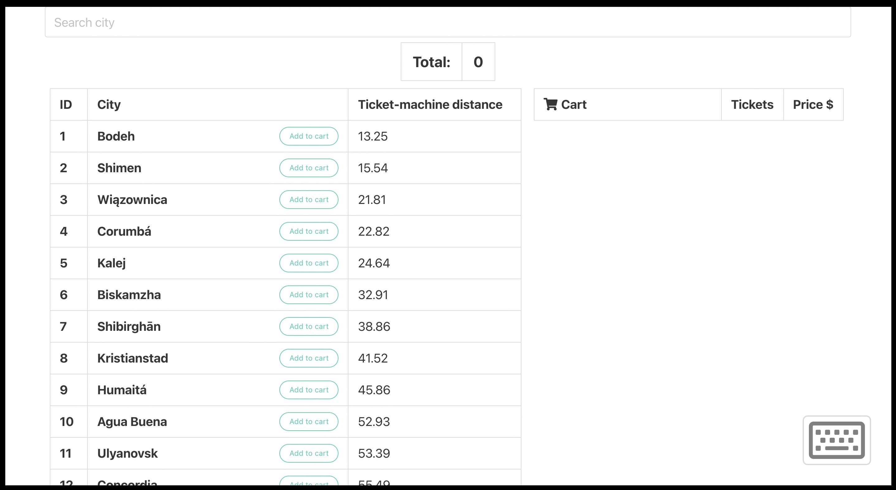
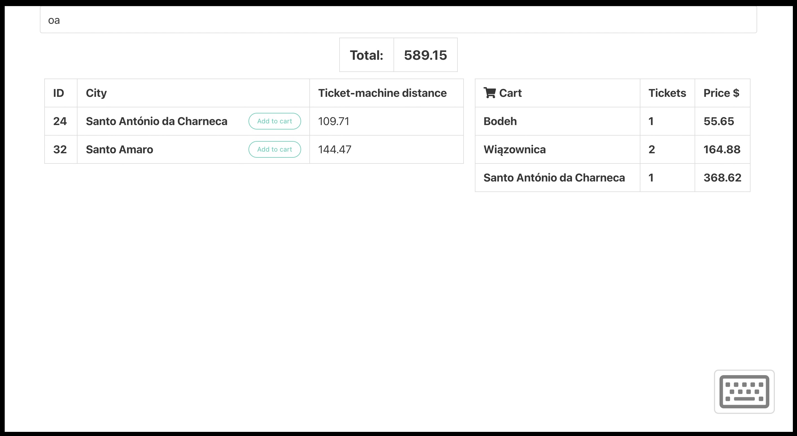
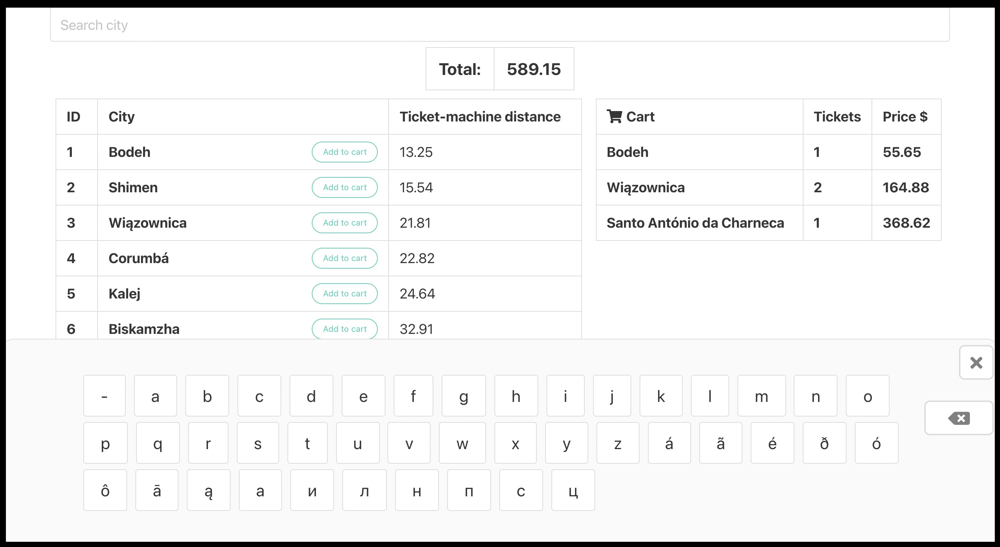
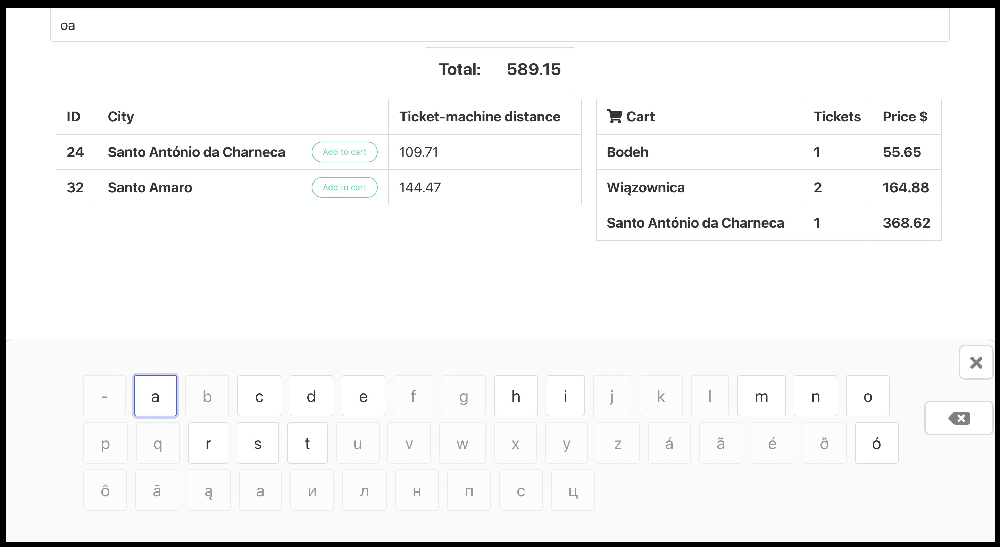

# Ticket-machine

The purpose of this task was to create a fake ticket-machine with city search function and on-screen keyboard. This excercise was done with pure javascript, html, css and css framework Bulma.
___
 

   
   
   
   

_______

## 1. Challenge

Asynchronously fetch data from `cities.json` and display that data on the website in table form.
_______
## 2. Challenge

Sort cities by their distance to the ticket-machine (attribute ` distance `).
_______
## 3. Challenge

Above the dynamically renderd list display a functional search bar that shortens the list of cities depending on the letter that was inputted.
_______
## 4. Challenge

Create a cart that can be filled with city tickets and add a price to each city ticket. To each city add a functional `add to cart` button. The price for each ticket will be calculated depending on the city's distance to the ticket-machine using this equation `ticketPrice = distance * 4.2`
_______
## 5. Challenge

Make the same city tickets group in the cart, display amount of tickets and sum of their price.
_______
## 6. Challenge

Above the cities list display a total sum of all tickets currently residing in the cart.
_______
## 7. Challenge

Create a on-screen keboard with letters corresponding to the currently avalible cities. When the cities list has shortened disabled unnecessary keys.

`Example`

For cities:

- Gdańsk
- Sopot
- Gdynia

Currently avalible keys on the keyboard:
-  `adgiknopstyń`

Letters height shouldn't be considered in the search.
After inputting `g`, list of the cities above should be shortened to;

- Gdańsk
- Gdynia

Currently avalible keys on the keyboard:

- `adgiknń`

If a city name is composed of two words for example `New York`, then the searched phrase like `ewy` should find that city (N`ew Y`ork).
